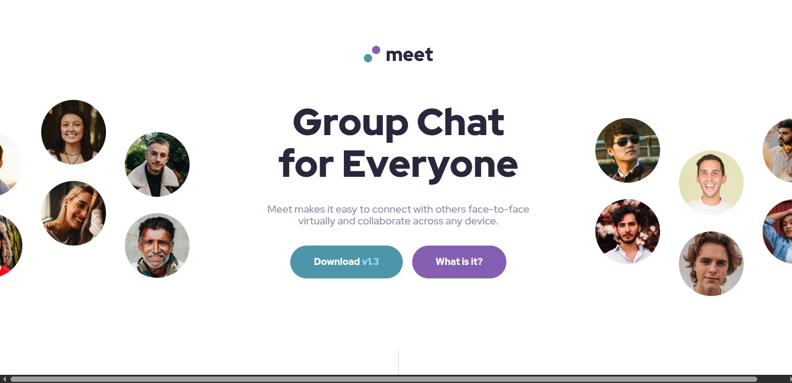

# Frontend Mentor - Meet landing page solution

This is a solution to the [Meet landing page challenge on Frontend Mentor](https://www.frontendmentor.io/challenges/meet-landing-page-rbTDS6OUR). Frontend Mentor challenges help you improve your coding skills by building realistic projects.

## Table of contents

- [Overview](#overview)
  - [The challenge](#the-challenge)
  - [Screenshot](#screenshot)
  - [Links](#links)
- [My process](#my-process)
  - [Built with](#built-with)
  - [What I learned](#what-i-learned)
  - [Useful resources](#useful-resources)
  - [AI Collaboration](#ai-collaboration)
- [Author](#author)

## Overview

### The challenge

Users should be able to:

- View the optimal layout depending on their device's screen size
- See hover states for interactive elements

### Screenshot

### Links

- Solution URL: [https://github.com/vibesprint/meet-landing-page](https://github.com/vibesprint/meet-landing-page)
- Live Site URL: [https://vibesprint.github.io/meet-landing-page](https://vibesprint.github.io/meet-landing-page)

## My process

### Built with

- Semantic HTML5 markup
- CSS custom properties
- Flexbox
- CSS Grid
- Desktop-first workflow
- Sass CSS

### What I learned

Learned in this challenge how some of the things can be easier to do in CSS grid or flexbox rather than the other. I had initially
done the hero section in flexbox, but then on facing many difficulties in layouting them, I decided to switch to CSS grid.
And in grid I saw the answer to the problems were just there. For example, initially the hero was in flexbox, but then when I
was doing the breakpoints for tablets, there the hero image goes on the top of the texts. I was finding it difficult
to swtich to that. So I changed my initial flexbox layout to grid. And it was solved thereafter.

Also learned automatic sizing of child elements in flexbox. Like by default the sizing in the cross-axis is in stretch, so they take
up all the space in cross-axis. The moment we change the cross-axis to center or flex-start or end, the sizing switches to the
content sizing.

Also setting max-width and min-width on img, hoping that the image will resize when flex container resizes, that is not going to happen.
If the image is greater than max-width, then the img element is always going to take max-width, even though it's flex container
is small and it will overflow. In such cases, we have to set the max-width to 100%, so that images does not overflow it and
it resizes with the container.

### Useful resources

- [https://developer.mozilla.org/en-US/docs/Web/HTML/Reference/Elements/picture](https://developer.mozilla.org/en-US/docs/Web/HTML/Reference/Elements/picture) - For responsive selection of image based on media query
- [https://developer.mozilla.org/en-US/docs/Web/CSS/Reference/Properties/object-position](https://developer.mozilla.org/en-US/docs/Web/CSS/Reference/Properties/object-position) - For positioning image inside a container like <picture> element, can also be used elsewhere, don't know about all of them
- [https://developer.mozilla.org/en-US/docs/Web/CSS/Reference/Properties/background-position](https://developer.mozilla.org/en-US/docs/Web/CSS/Reference/Properties/background-position) - For positioning background image of a container

### AI Collaboration

Used Claude for debugging purposes. Sometimes the properties were not taking effect. In those times I asked Claude to help me debug the
situation.

## Author

- Github - [vibesprint](https://github.com/vibesprint)
